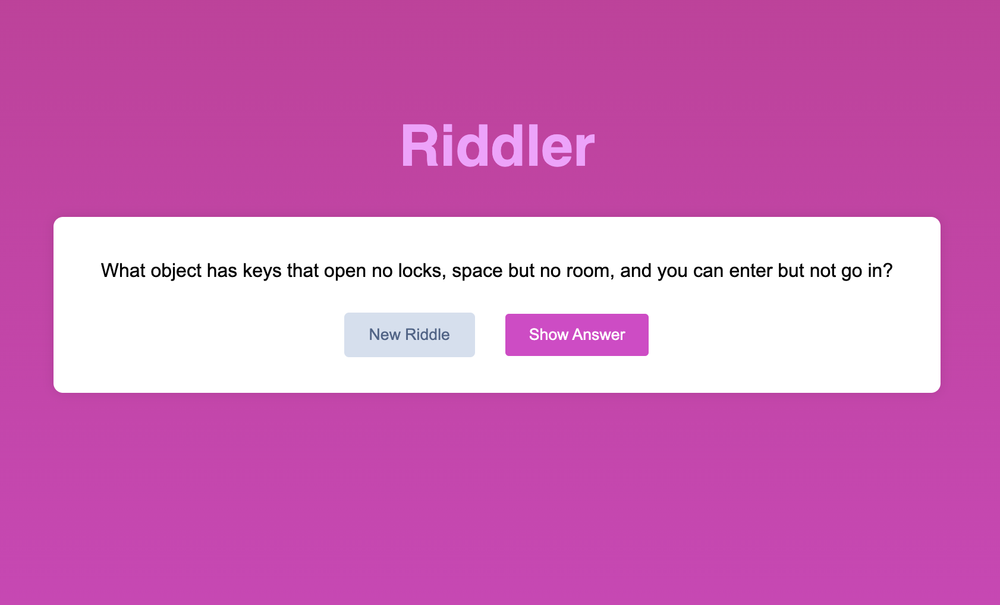

# Riddle App

https://riddler.thoria.dev

A simple web application that fetches random riddles from an API and displays the answer when requested. This project is designed for beginners to practice HTML, CSS, and JavaScript.

## Features

- **Fetch Random Riddles**: Click the "New Riddle" button to fetch and display a new riddle from the [Riddles API](https://riddles-api.vercel.app/random).
- **Reveal the Answer**: Click the "Show Answer" button to reveal the answer to the displayed riddle.
- **Simple and Responsive Design**: Basic layout using HTML and CSS, designed to be user-friendly and responsive.

## Demo



Spoiler: It's a keyboard!

## How to Use

### Prerequisites

- A web browser (Chrome, Firefox, etc.)
- Basic knowledge of HTML, CSS, and JavaScript.

### Installation

1. **Clone the repository**:
   ```bash
   git clone https://github.com/thoria-subahi/riddler.git
   ```